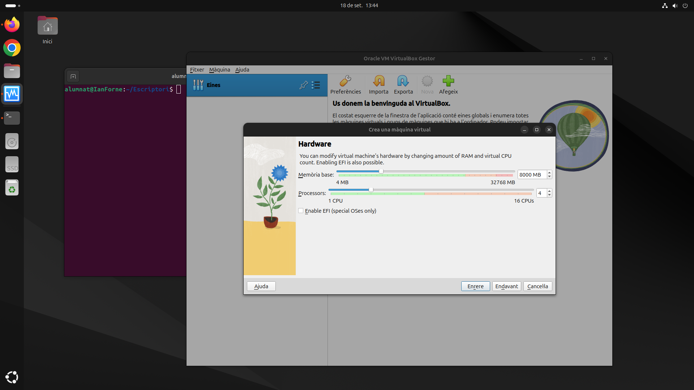
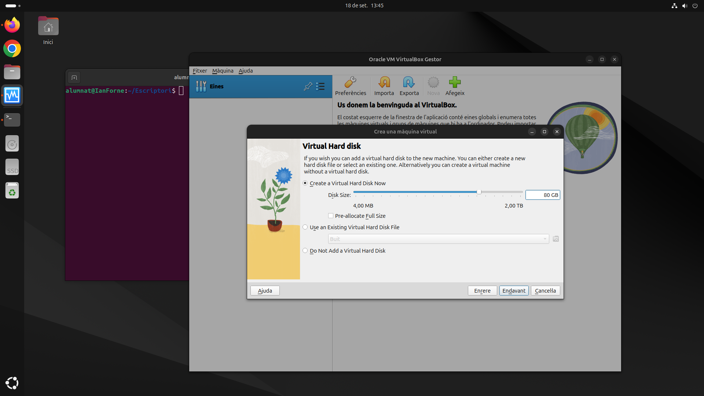
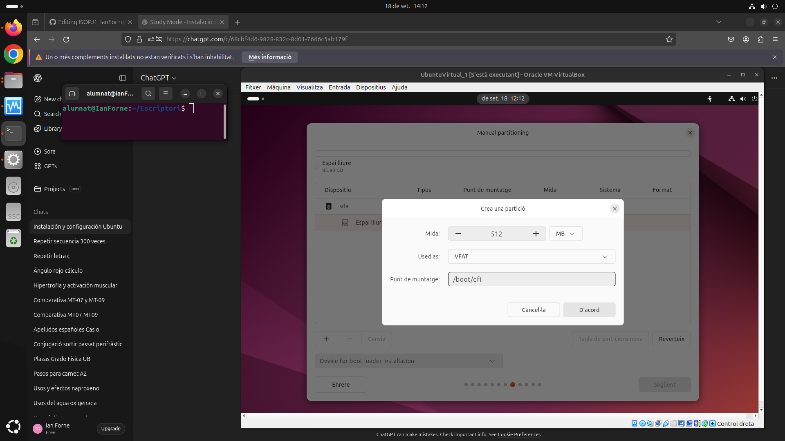

## Virtualització i instal·lació del so Ubuntu

El primer que he fet ha sigut crear una màquina virtual. Per a saber les especificacions per la mateixa, he preguntat al chatGPT amb el meu cas específic quines serien les millors especificacions. En el meu cas, m'ha recomanat posar 8gb de memòria ram i 4 nuclis de cpu virtual.

A continuació, he asignat 80gb d'espai per a la màquina virtual.

-------------------------------

## Creació de les particions
 
En primer lloc, he creat una partició per al EFI. La partició de l'EFI es necessària si estem utilitzant UEFI, ja que s'encarrega de fer funciomar el carregador d'arranc del sistema operatiu. 
Aquesta partició s'utilitza com FAT32 o VFAT perqué UEFI només funciona amb aquest tipus. El tamany de 512 MB és suficient. 
El punt de muntatge està a: /boot/efi. Sense aquesta partició, el sistema no arrancaria en mode UEFI.

En segon lloc, he creat una partició per a al /root. Aqui es on viu el sistema operatiu, s'utulitza per emmagatzemar els programes, les llibreries, etc.

En tercer lloc, asduiashdishadhasdad

I finalment, el /home

## Llicenciament
## Gestors d'arrencada per a instal·lacións DUALS
## Punts de restauració
## Configuració de la xarxa
## Comandes generals i instal·lacions
